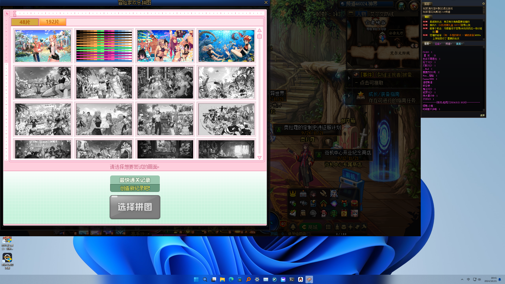

### 1、下载补丁安装后重启游戏

补丁地址：[度盘](https://pan.baidu.com/s/18r_NcovoP9uhQExrfBmRkg)，提取码：z1b2

### 2、将游戏窗口和小游戏的左上角和屏幕的左上角尽量重合

如图所示：



### 3、修改相关参数

- block_size：单个拼图图块的大小
    > 
- offset：拼图区域离左上角的偏移量
    > 
- choose_point_top：待选择拼图图块上部分中心的位置
    > 
- choose_point_bottom：待选择拼图图块下部分中心的位置
    > 
- image_position：打了补丁后第二张192块拼图中心的位置
    > 
- start_position：开始游戏按钮中心的位置
    > 
- confirm_position：完成一轮游戏后点击确认按钮中心的位置
    > 
- count：执行轮次，一轮50硬币

除了图块大小，其余位置和偏移量都是屏幕左上角（0，0）到对应位置的坐标，可以使用QQ自带的截图工具或者你熟悉的工具从拖动获取

### 4、运行项目

**！！！以管理员权限运行命令行工具，再运行以下命令：**

**！！！以管理员权限运行命令行工具，再运行以下命令：**

**！！！以管理员权限运行命令行工具，再运行以下命令：**

```bash
uv sync
uv run auto_puzzle.py
```

没有（也不想）安装 [uv](https://github.com/astral-sh/uv) ?

> 将`auto_puzzle.py`和`color_index.py`复制到单独的文件夹，使用`pip`或者其它工具安装`pyproject.toml`里`dependencies`包含的依赖，最后（管理员权限）运行`auto_puzzle.py`。